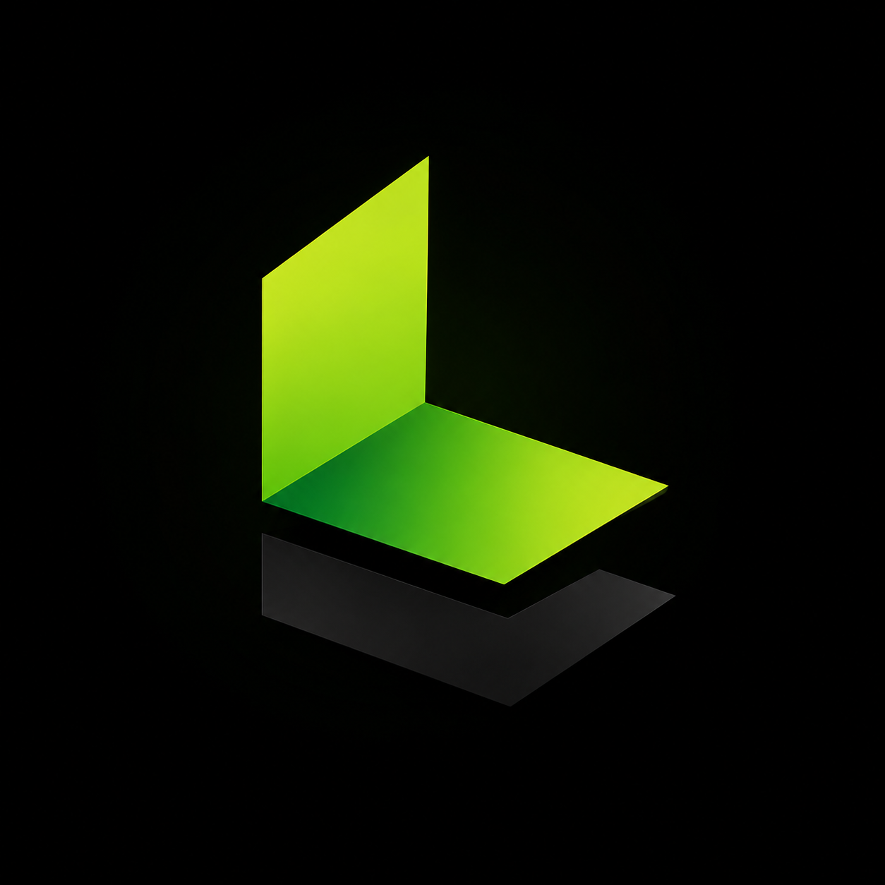

# Launch Layer Fiji

### Building Powerful Web Applications for Businesses in Fiji and Beyond

---

## 🌏 About Us

Launch Layer Fiji is a software development company based in **Fiji**, focused on delivering modern, secure, and scalable web applications.

We partner with startups, businesses, and government organizations to transform ideas into digital products using modern technologies and best development practices.

> **From concept to deployment - we build software that works.**

---

## 🛠️ Technologies We Love

---

# 🚀 Development Journey

| 💡 Discover | 📋 Plan | 🎨 Design | 💻 Build |
|:----------:|:-------:|:---------:|:---------:|
| Understand your business | Define the solution | Create beautiful UI/UX | Develop secure applications |

⬇️

| 🧪 Test | 🚀 Deploy | 📈 Grow | 🤝 Support |
|:-------:|:---------:|:-------:|:----------:|
| Quality Assurance | Production Release | Continuous Improvements | Long-Term Partnership |

---
# ✨ Why Choose Launch Layer Fiji?

<table>
<tr>

<td>

### ⚡ Fast Development

Efficient workflows and agile development.

</td>

<td>

### 🔒 Secure

Security-first approach to every project.

</td>

<td>

### 📈 Scalable

Applications designed to grow with your business.

</td>

</tr>

<tr>

<td>

### 🎯 Custom Built

Every solution is tailored to your needs.

</td>

<td>

### ☁️ Cloud Ready

Deploy anywhere with confidence.

</td>

<td>

### 🤝 Reliable Support

We're here long after launch.

</td>

</tr>

</table>

---

# 📊 GitHub Activity

---

# 🌐 Our Services

| 💻 Development | ☁ Cloud | 🔒 Security |
|:--------------|:---------|:------------|
| Custom Web Applications | Cloud Deployment | Security Best Practices |
| REST APIs | DevOps | Authentication |
| Database Systems | Hosting | Data Protection |

| ⚙ Automation | 📈 Business | 🛠 Support |
|:-------------|:------------|:------------|
| Workflow Automation | Digital Transformation | Maintenance |
| System Integration | Consulting | Technical Support |

---

# 📍 Proudly Based in Fiji

### Proudly Developing from the Heart of the Pacific

Creating modern software solutions that empower businesses across Fiji and beyond.

From startups to enterprises, we build secure, scalable and innovative web applications that help organizations embrace digital transformation.

**Made with ❤️ in Fiji**

---

### 🟢 Launch Layer Fiji

**Building the Future, One Application at a Time**

⭐ **If you like our work, consider following us on GitHub!**

